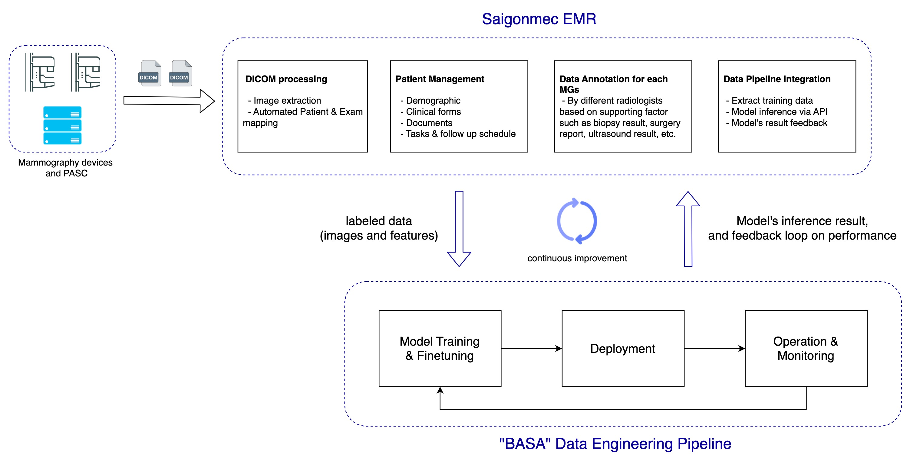
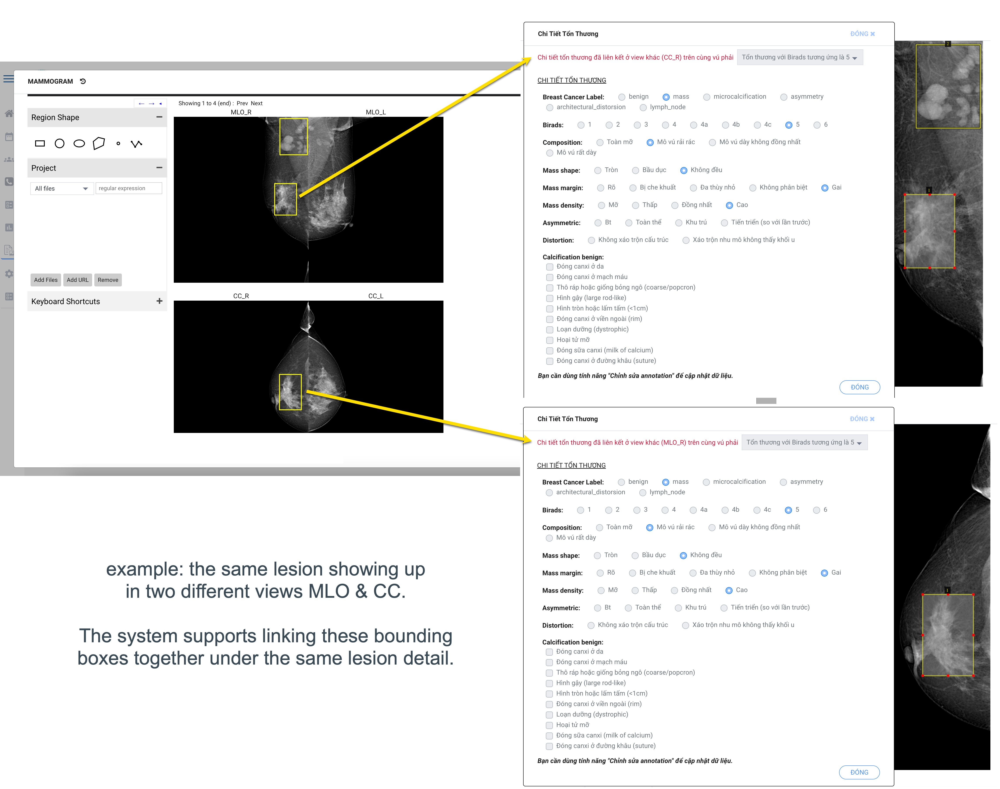

# Introduction
Saigonmec EMR is an open-source electronic medical record (EMR) with built-in DICOM interface, imaging data annotation and integration with a Data Engineering Pipeline. 

It's part of an end-to-end platform for development & deployment of mammogram-based AI in the clinical setting. The platform has two integrated parts: Saigonmec EMR (this repo) and the "BASA" Data Engineering Pipeline.

The following diagram shows an overview of the platform:

Source code of the entire platform including EMR and Data Engineering Pipeline is scheduled to be released in 2024. It is essential for us to conduct a thorough evaluation of the platform and the core AI model to ensure that their reliability, responsibility, and safety align with the demands of real clinical scenarios.

## Why do we develop this platform?
The team started our breast cancer AI research project 1.5 years ago. The goal is to develop an AI model as a robust diagnostic tool that can accurately detect malignant lesions and forecast the cancer risk based on mammography. The architecture should be open, clinical-friendly, inclusive and reproducible.

There are daunting challenges when the team gets started: reference models, tools and infrastructure are not openly available. After searching for a while with no success, we set out to build and integrate the necessary components together. Also, applying AI in medicine requires more than training ML/DL models; significant amounts of engineering are required to successfully deploy into the clinical setting.

Later on we realized that those are also common challenges in applying AI into medicine; and therefore it would have a greater impact if we could open source all the components as a solid starting point for any healthcare facilities around the world.

# Capabilities of the EMR
- Patient management: demographic, clinical forms, files and built-in viewer, tasks and follow up schedule based on various customizable criteria
- Automatic link between patient and DICOM files retrieved from PACS or imaging modalities. The system is focusing on Mammogram (MG) for now; however it can be extended to support other modalities such as CT/MRI/Pathology in the future
- Data annotation feature specialized for Mammogram: 
    - customizable properties of each bounding box based on BIRADs standard
    - ability to link lesion between different views of the same breast side 
    - various scheme of permission control in order to reduce bias in data labeling
- Integration with the Data Engineering Pipeline: 
    - Extract the annotated data for model training
    - Connect with the pre-trained model via API for inference result of any mammogram in the system
    - Feedback feature about model's performance for continuous model improvement
- Audit log and detail reports of all activities within the EMR

# Sample screenshot

# Technical stack
- Frontend: React 17+
- Backend: Node.js 14+
- Database: MySQL 8.x, supporting both relational and json-document for greater data retrieval efficiency

The system can be deployed on-premise, via container or in a cloud environment.

# System requirements
The EMR is designed to be lightweight and could run well on commodity hardware. 

At the time of this writing (10/2023): a 2 CPUs, 4 GB RAM Ubuntu server can support:
- 18,000 Mammogram DICOM files with 7 TB of data (stored on disk or cloud storage)
- 10,000+ patients with clinical data
- 1,000+ Mammogram with annotation done by several radiologist for each annotation
- 40+ users with different roles for permission control

So far the EMR code has more than 1,000+ commits. The team is actively working on integration with the Data Engineering Pipeline and improving various aspects of the system before an open-source release.

# Contribute

We love your support! This project cannot be done without help from the community. Thank you 🙏 to all our contributors!

# License

  

 

- **AGPL-3.0**: This [OSI-approved](https://opensource.org/license/agpl-v3/) open-source license promotes open collaboration and knowledge sharing.

# Contact 
In case you have any question about the ongoing work, please feel free to visit us at [Saigonmec](https://saigonmec.org/) or drop us a line at [contact@saigonmec.org](mailto:contact@saigonmec.org)